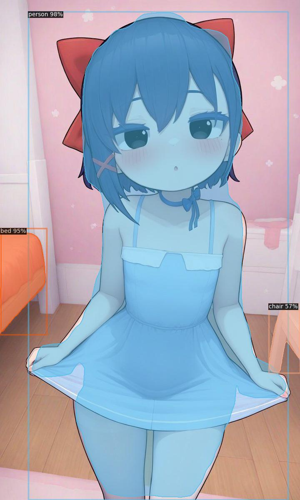

# Image Detection

Image Detection is a Python-based app that detects and highlights key objects in images and GIFs. It uses edge detection, feature matching, and async processing to handle different file types, drawing boxes around detected areas.

### Features:
- **Async Loading**: Quickly loads and caches image data.
- **Edge Detection**: Uses ORB keypoints and FLANN-based matching to find features.
- **GIF Support**: Processes GIFs, adds boxes, and saves the results as new GIFs.
- **URL Support**: Lets you load images from URLs.
- **Progress Tracking**: Shows progress with tqdm while processing GIFs.

---

### Detected Body and Face GIF

This GIF shows how the app highlights faces in GIFs. It detects faces in each frame using a DNN-based detector and draws a box around each face.

**How It Works**:
- **Face Detection**: Uses OpenCV's DNN-based face detector (Caffe model) to find faces.
- **Body Detection**: Uses YOLOv4 (You Only Look Once version 4) for detecting bodies (even some objects).
- **Box Refinement**: Adjusts boxes with facial landmarks for a better fit.
- **GIF Processing**: Processes each frame and saves the result as a new GIF.

The final result is a GIF with faces accurately highlighted frame by frame.

---

### Sample Output and Code Explanation

Below is a demonstration of the detection result on an input GIF and static image:

  
*Detected objects annotated frame by frame in a GIF.*

  
*Single-frame detection result on a static image.*

**What the code does**:
- Loads the input image or GIF using OpenCV and Pillow.
- For static images:
  - Runs detection models (face and/or body).
  - Draws bounding boxes on detected objects.
  - Saves the final output as a `.jpg`.
- For GIFs:
  - Splits the GIF into frames.
  - Applies the detection logic to each frame.
  - Overlays boxes on detected areas.
  - Reassembles frames into a new animated `.gif`.
- Uses asynchronous processing and efficient image pipelines to reduce delay and handle multiple frames rapidly.
- Applies color-coded bounding boxes with category labels (e.g., "Face", "Person").

---

For further customization or integration, refer to the `detect_objects.py` and `process_gif.py` scripts, which contain the detection pipelines, frame handlers, and export logic.

